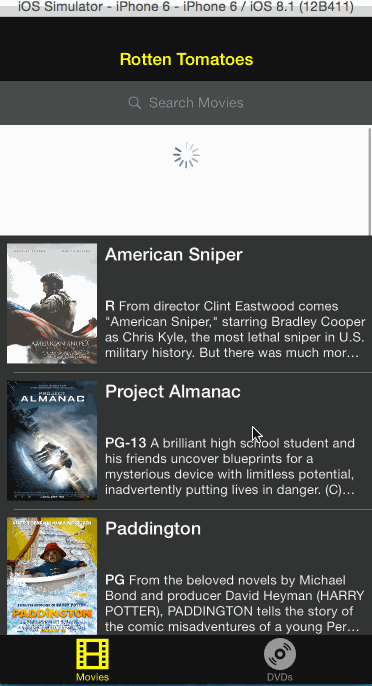

## Rotten Tomatoes

This is a movies app displaying box office and top rental DVDs using the [Rotten Tomatoes API](http://developer.rottentomatoes.com/docs/read/JSON).

Time spent: **12 hours**

### Notes

The architecture for this application is
[MVVM](http://en.wikipedia.org/wiki/Model_View_ViewModel) -- I'm a big
fan of it as a general design pattern so I try to practice with it
whenever possible. This particular architecture is based on Colin
Eberhardt's work shown
[here](http://www.raywenderlich.com/74106/mvvm-tutorial-with-reactivecocoa-part-1),
but with the [Bond](https://github.com/SwiftBond/Bond) library used
in place of ReactiveCocoa and in Swift rather than Obj-C (obviously).

A binding library in this project is of little use due to the lack of
much user-provided input to the app, but was still neat to work with.

### Features

#### Required

- [x] User can view a list of movies. Poster images load asynchronously.
- [x] User can view movie details by tapping on a cell.
- [x] User sees loading state while waiting for the API.
- [x] User sees error message when there is a network error: http://cl.ly/image/1l1L3M460c3C
- [x] User can pull to refresh the movie list.

#### Optional

- [x] All images fade in.
- [x] For the larger poster, load the low-res first and switch to high-res when complete.
- [ ] All images should be cached in memory and disk: AppDelegate has an instance of `NSURLCache` and `NSURLRequest` makes a request with `NSURLRequestReturnCacheDataElseLoad` cache policy. I tested it by turning off wifi and restarting the app.
- [ ] Customize the highlight and selection effect of the cell.
- [ ] Customize the navigation bar.
- [x] Add a tab bar for Box Office and DVD.
- [x] Add a search bar: pretty simple implementation of searching against the existing table view data.

#### Additional

- [x] Segmented control to toggle between DVD list types.

### Walkthrough

Created with [LiceCap](http://www.cockos.com/licecap/)

Credits
---------
* [Rotten Tomatoes API](http://developer.rottentomatoes.com/docs/read/JSON)
* [AFNetworking](https://github.com/AFNetworking/AFNetworking)
* [SwiftyJSON](https://github.com/SwiftyJSON/SwiftyJSON)
* [Bond](https://github.com/SwiftBond/Bond)
* [JGProgressHUD](https://github.com/JonasGessner/JGProgressHUD)
